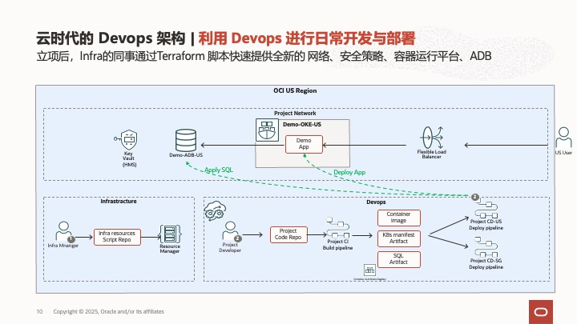
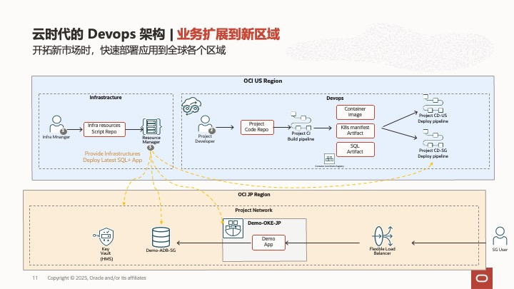
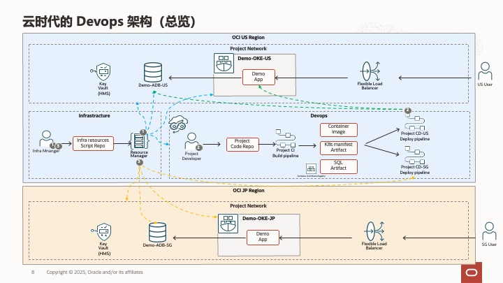

[English](README_EN.md) | 中文

## 项目概述

本项目展示了在Oracle云基础设施(OCI)上使用Terraform自动化部署资源和通过OCI DevOps实现CI/CD流水线的完整流程，将应用程序部署到Oracle Kubernetes Engine (OKE)并连接到Autonomous Database (ADB)后端。

项目包含以下3个核心场景：

## 场景1：新项目环境搭建

本场景提供基础设施自动化部署方案，使用Terraform脚本一键创建Virtual Cloud Network (VCN)、Autonomous Database (ADB) 和Oracle Kubernetes Engine (OKE) 集群，并配置DevOps 部署流水线。


主要功能包括：
- 自动创建云网络，并设置安全规则
- 自动创建Autonomous Database并初始化数据库
- 部署Oracle Kubernetes Engine集群
- 配置DevOps项目和CI/CD流水线

一键部署：
[](https://cloud.oracle.com/resourcemanager/stacks/create?zipUrl=https://github.com/WilburOracle/DevOps-OKE-ADB-Demo/releases/download/0.0.2/Scenario1_new_project.zip)

## 场景2：DevOps CI/CD流水线实践

本场景展示如何利用已有的基础设施，通过OCI DevOps实现应用程序的持续集成和持续部署。



主要功能包括：
- 基础的服务端应用代码(server目录)
- CI Build Pipeline中第1阶段的编译步骤说明文件(build_spec.yaml)
- CI Build Pipeline中第1阶段的第1个编译步骤：编译Docker镜像(Dockerfile文件)
- 发布编译结果到镜像仓库和制品仓库中
- 执行 CD Deployment Pipleline，将SQL部署到数据库，将应用部署到OKE集群

## 场景3：多区域部署

本场景演示如何在新的区域快速部署完整的应用环境。
与场景1类似，本场景提供基础设施自动化部署方案，使用Terraform脚本一键创建Virtual Cloud Network (VCN)、Autonomous Database (ADB) 和Oracle Kubernetes Engine (OKE) 集群，并配置DevOps 部署流水线。
与场景1不通的是，场景3不仅仅提供了基础设施，还用Terraform脚本部署了最新版本的数据库Schema和最新版本的应用。



主要功能包括：
- 自动创建云网络，并设置安全规则
- 自动创建Autonomous Database并初始化数据库，并且部署最新版本的数据库Schema
- 部署Oracle Kubernetes Engine集群，并且部署最新版本的应用
- 配置DevOps项目和CI/CD流水线

一键部署：
[](https://cloud.oracle.com/resourcemanager/stacks/create?zipUrl=https://github.com/WilburOracle/DevOps-OKE-ADB-Demo/releases/download/0.0.2/Scenario3_new_region.zip)

## 项目架构图



## 项目结构

```
├── Scenario1_new_project/  # 新项目环境搭建相关代码
│   └── infra_terraform/    # Terraform基础设施代码
├── Scenario2_devops_cicd/  # DevOps CI/CD实践相关代码
│   └── project_codes/      # 项目应用代码
├── Scenario3_new_region/   # 多区域部署相关代码
    └── infra_terraform/    # Terraform跨区域部署代码
```
