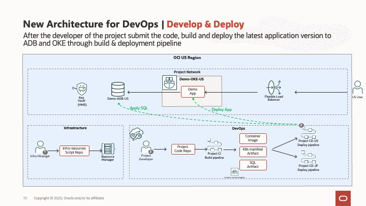

[中文](README.md) | English

## Project Overview

This project demonstrates the complete process of automated resource deployment using Terraform on Oracle Cloud Infrastructure (OCI) and implementing CI/CD pipelines through OCI DevOps to deploy applications to Oracle Kubernetes Engine (OKE) connected to Autonomous Database (ADB) backend.


The project includes the following 3 core scenarios:

## Scenario 1: New Project Environment Setup

This scenario provides an automated infrastructure deployment solution, using Terraform scripts to create Virtual Cloud Network (VCN), Autonomous Database (ADB) and Oracle Kubernetes Engine (OKE) cluster with one click, and configure DevOps deployment pipeline.


Main features include:
- Automatically create cloud network and set security rules
- Automatically create Autonomous Database and initialize the database
- Deploy Oracle Kubernetes Engine cluster
- Configure DevOps project and CI/CD pipeline

One-click deployment:
[](https://cloud.oracle.com/resourcemanager/stacks/create?zipUrl=https://github.com/WilburOracle/DevOps-OKE-ADB-Demo/releases/download/0.0.2/Scenario1_new_project.zip)

## Scenario 2: DevOps CI/CD Pipeline Practice

This scenario demonstrates how to leverage existing infrastructure to implement continuous integration and continuous deployment of applications through OCI DevOps.



Main features include:
- Basic server-side application code (server directory)
- Build specification file for the first stage in CI Build Pipeline (build_spec.yaml)
- First compilation step in the first stage of CI Build Pipeline: compiling Docker image (Dockerfile)
- Publish compilation results to image repository and artifact repository
- Execute CD Deployment Pipeline to deploy SQL to database and deploy applications to OKE cluster

## Scenario 3: Multi-Region Deployment

This scenario demonstrates how to quickly deploy a complete application environment in a new region.
Similar to Scenario 1, this scenario provides an automated infrastructure deployment solution, using Terraform scripts to create Virtual Cloud Network (VCN), Autonomous Database (ADB) and Oracle Kubernetes Engine (OKE) cluster with one click, and configure DevOps deployment pipeline.
Unlike Scenario 1, Scenario 3 not only provides infrastructure but also deploys the latest version of database Schema and the latest version of the application using Terraform scripts.


Main features include:
- Automatically create cloud network and set security rules
- Automatically create Autonomous Database and initialize the database, and deploy the latest version of database Schema
- Deploy Oracle Kubernetes Engine cluster and deploy the latest version of the application
- Configure DevOps project and CI/CD pipeline

One-click deployment:
[](https://cloud.oracle.com/resourcemanager/stacks/create?zipUrl=https://github.com/WilburOracle/DevOps-OKE-ADB-Demo/releases/download/0.0.2/Scenario3_new_region.zip)

## Project Structure

```
├── Scenario1_new_project/  # Code related to new project environment setup
│   └── infra_terraform/    # Terraform infrastructure code
├── Scenario2_devops_cicd/  # Code related to DevOps CI/CD practice
│   └── project_codes/      # Project application code
├── Scenario3_new_region/   # Code related to multi-region deployment
    └── infra_terraform/    # Terraform cross-region deployment code
```